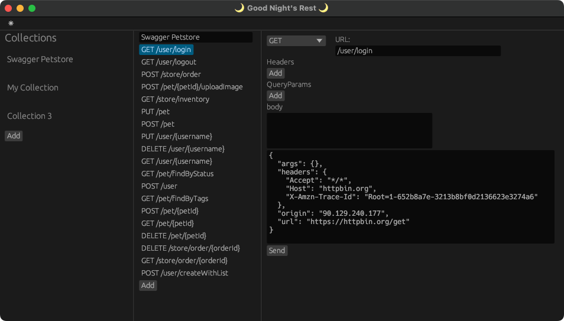

# 🌙 Welcome to "Good Night's Rest" 🌙

I'm working on a (free) REST client (just a hobby, won't be a big and professional 
cloud platform like Kong) for those who believe that REST is best enjoyed 
without clouds looming overhead. This has been brewing since "the incident,"
and it's starting to take shape. I'd love to hear any feedback on things people 
like/dislike in existing REST clients, as Good Night's REST aims to offer a dreamy
experience (with a sprinkle of jokes to make you snore... I mean, smile!).

## The Problem
Are you tired of open-source projects that rug pull and suddenly try to become 
a cloud service even though they're basically a generic wrapper around the unit 
tests you write every day?

Are you tired of launching an entire browser engin/memory load test for every 
application on your desktop?

## The Solution
Well, we don't want you to be tired; we want you to sleep easy knowing that this 
simple application, which you could probably rewrite in a weekend, 
will always be open source. That's why it's licensed as GPL 2, the way Linus intended.

And yes, it's written in Rust, because why rewrite it in a weekend when you 
can "Rewrite it in Rust" and have a ton of compile-time errors. Hey it was either
that or rewrite it in C and have me break your computer with pointer arithmetic.

## Project Principles
### 1. The only requests are your requests
The only network requests an app like this should be making are the ones in your 
collection, there will never be any telemetry or analytics in this app.

### 2. Do one thing well
This app will focus on making HTTP requests and nothing else. It will not try to
be a full-fledged API testing tool, if you want to execute programmatic assertions
against your API what you are looking for is an end to end testing, i suggest 
this thing called code, works great and is fully customisable.

### 3. Keep it as standard as possible
We will strive to not reinvent any wheels, for instance collections will be stored
in the OpenAPI format and variables will use the same syntax as environment variables.
All requests should always be exportable as curl scripts with environment variables and
all collections should be exportable as ready to use OpenAPI files.

### 4. Secure by default
Exports should NEVER contain the contents of the environment variables, only 
their names. That way you don't have to do weird gymnastics when handing a collection to a colleague.
Seriously who thought that was a good idea, if ever created such a thing, it would keep me 
up at night.

## Planned features
 - [x] Add requests to a collection 
 - [x] Edit and execute requests
 - [ ] Handle multiple collections
 - [ ] Save collections to a Swagger/OpenAPI file
 - [ ] Load collections from a Swagger/OpenAPI file 
 - [ ] Import from curl
 - [ ] Export to curl
 - [ ] Handle custom variables in requests
 - [ ] Secure variables
